# Network Guardian AI - Architecture Documentation

A comprehensive guide to the system architecture, evolution phases, and technical implementation.

---

## Table of Contents
1. [System Overview](#system-overview)
2. [Phase 1: Foundation](#phase-1-foundation-days-1-4)
3. [Phase 2: Core Logic](#phase-2-core-logic-days-5-11)
4. [Phase 3: Optimization](#phase-3-optimization-days-12-16)
5. [Complete Architecture](#complete-architecture)
6. [File Structure](#file-structure)
7. [Data Flow](#data-flow)
8. [Performance Metrics](#performance-metrics)

---

## System Overview

Network Guardian AI is an automated threat intelligence pipeline that transforms network security monitoring from passive blocking to active, explainable AI-driven analysis.

### Core Capabilities
- **Real-time Threat Detection**: Monitor DNS traffic and analyze threats in real-time
- **Multi-layered Analysis**: Shannon Entropy → Isolation Forest → Gemini AI
- **Explainable AI**: Human-readable explanations for security decisions
- **Persistent Audit Trail**: Google Sheets integration for compliance
- **80% Test Coverage**: Production-ready reliability

---

## Phase 1: Foundation (Days 1-4)

### Evolution Timeline

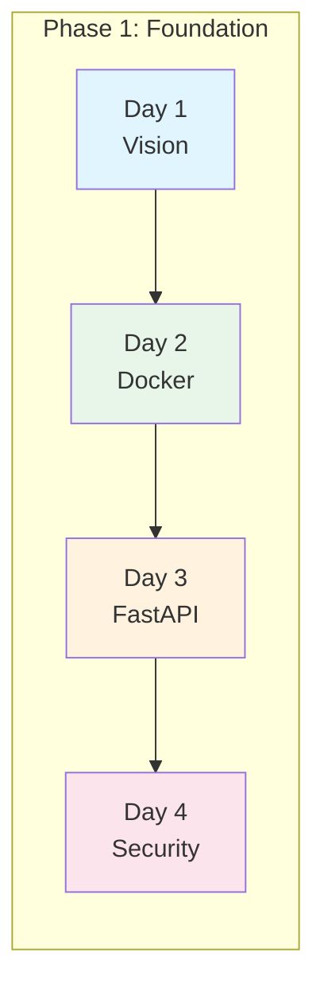

### Day 1: Problem Definition

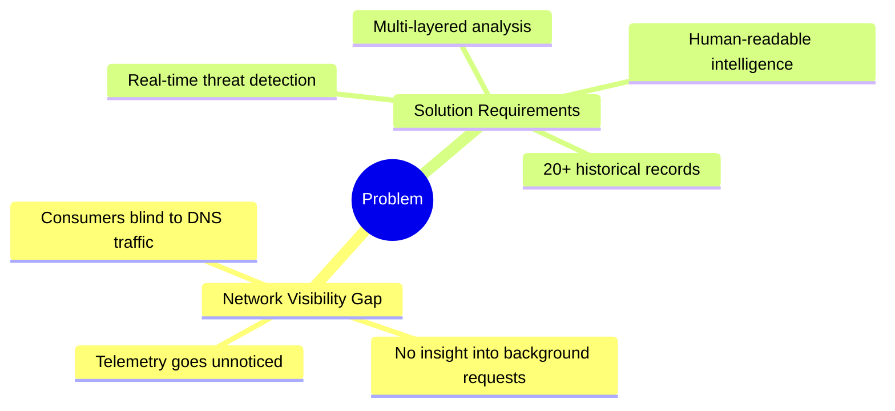

### Day 2: Docker Infrastructure

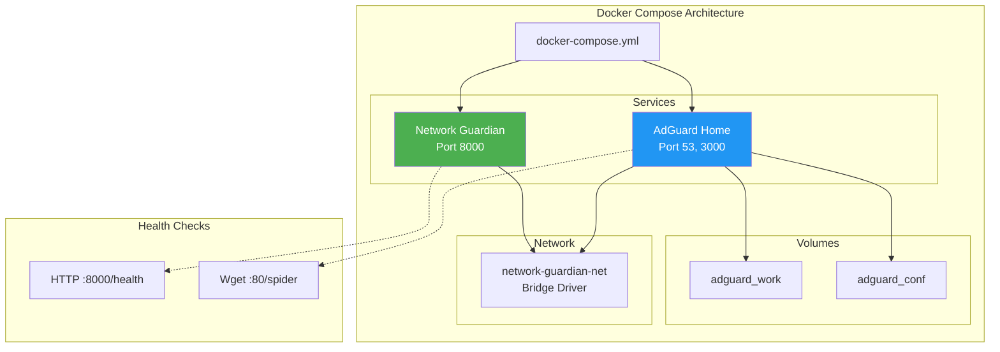

### Day 3: FastAPI Backend

```mermaid
graph TB
    subgraph "FastAPI Application Structure"
        MAIN[main.py<br/>App Entry Point]
        
        subgraph "Core Features"
            ASYNC[Async Processing]
            BG[Background Tasks]
            OD[OpenAPI Docs /docs]
        end
        
        subgraph "Endpoints"
            HEALTH[/health]
            ANALYZE[/analyze]
            CHAT[/chat]
            HISTORY[/history]
            STATS[/api/stats/system]
        end
        
        MAIN --> ASYNC
        MAIN --> BG
        MAIN --> OD
        MAIN --> HEALTH
        MAIN --> ANALYZE
        MAIN --> CHAT
        MAIN --> HISTORY
        MAIN --> STATS
    end
    
    style MAIN fill:#009688,color:#fff
    style ASYNC fill:#00bcd4,color:#fff
    style BG fill:#00bcd4,color:#fff
```

### Day 4: Security Patterns

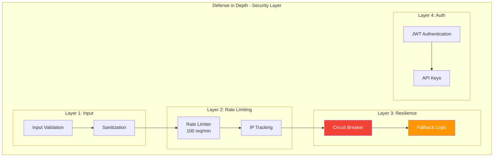

---

## Phase 2: Core Logic (Days 5-11)

### Evolution Timeline

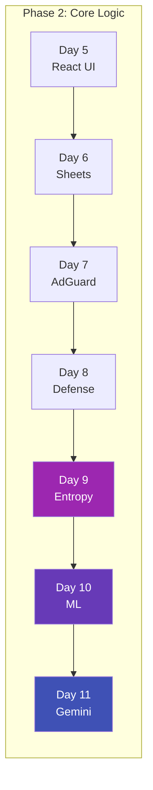

### Three-Stage Analysis Pipeline

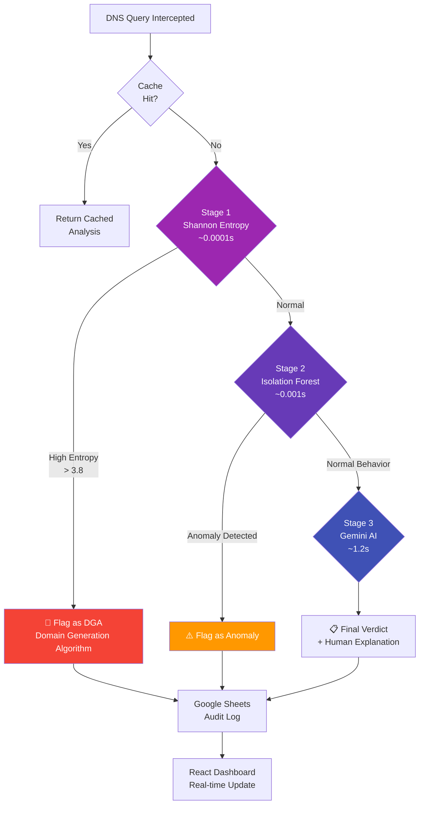

### Day 9: Shannon Entropy Implementation

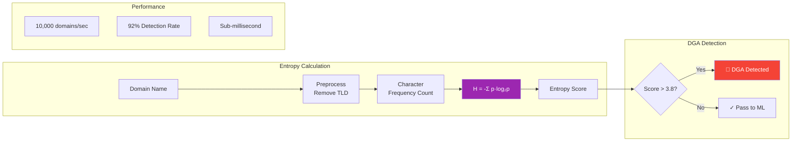

### Day 10: Isolation Forest ML

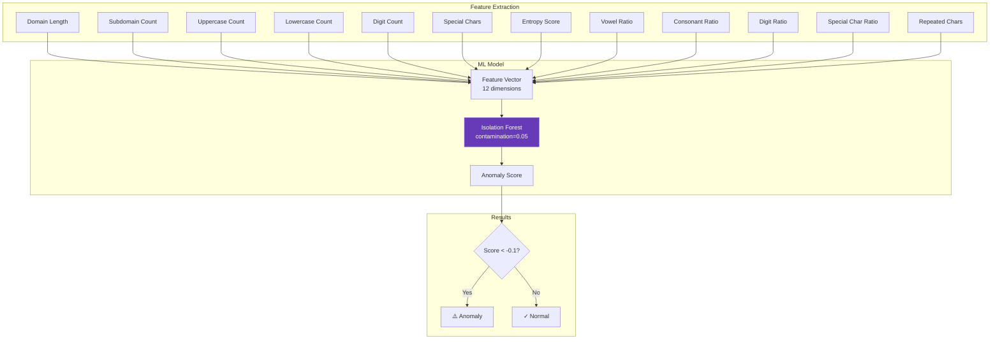

### Day 11: Google Gemini Integration

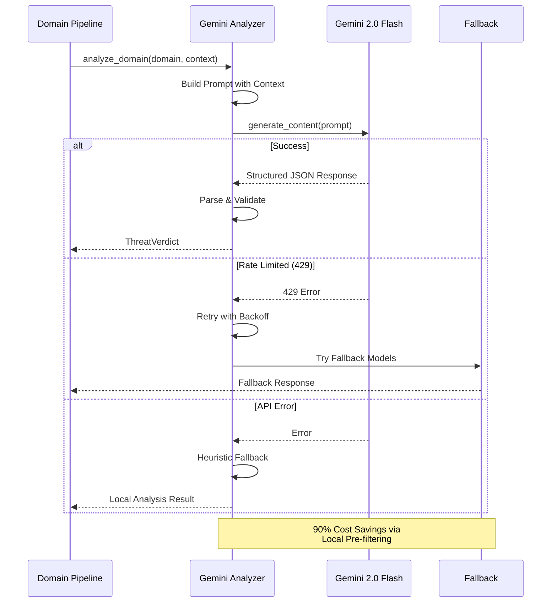

---

## Phase 3: Optimization (Days 12-16)

### Evolution Timeline

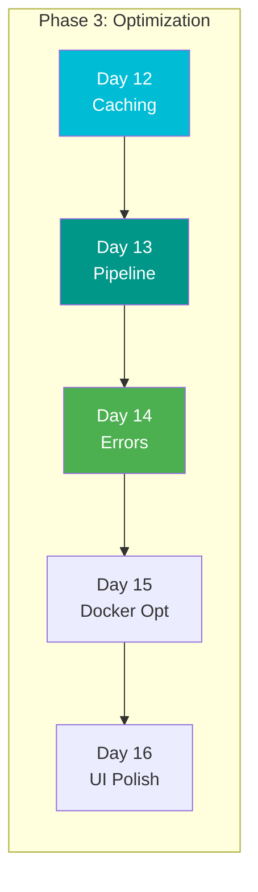

### Caching Strategy

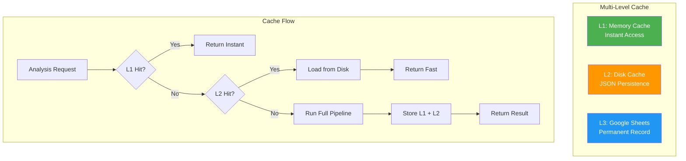

### Real-Time Pipeline Architecture

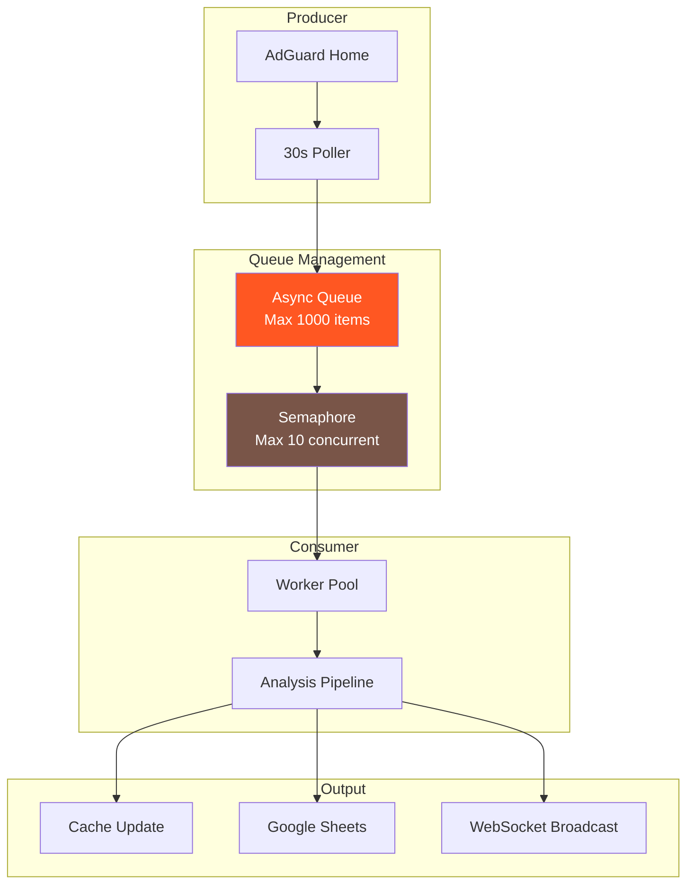

### Error Handling & Resilience

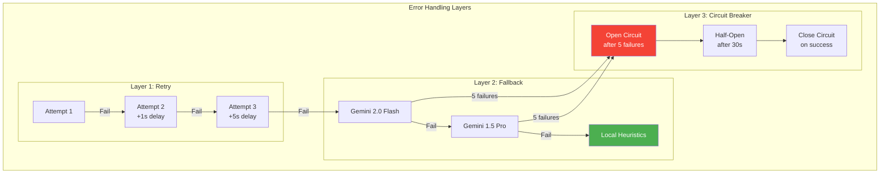

---

## Complete Architecture

### Full System Diagram

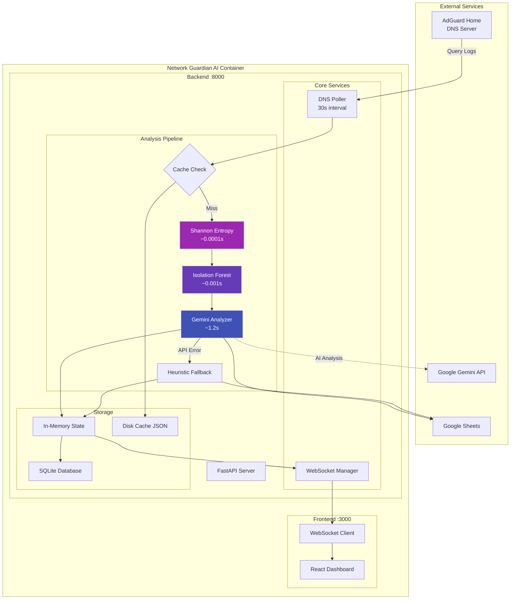

---

## File Structure

```
network-guardian-ai/
│
├── 📁 backend/
│   ├── 📄 __init__.py
│   ├── 📄 main.py                    # FastAPI app entry point
│   ├── 📄 requirements.txt           # Python dependencies
│   │
│   ├── 📁 api/                       # API Routes
│   │   ├── 📄 router.py              # Main API endpoints
│   │   ├── 📄 auth_router.py         # Authentication routes
│   │   ├── 📄 alert_router.py        # Alert management
│   │   ├── 📄 stats.py               # System statistics
│   │   └── 📄 ws_router.py           # WebSocket routes
│   │
│   ├── 📁 core/                      # Core Configuration
│   │   ├── 📄 config.py              # Settings (Pydantic)
│   │   ├── 📄 auth.py                # JWT & API Key management
│   │   ├── 📄 middleware.py          # Request middleware
│   │   ├── 📄 rate_limiter.py        # Rate limiting logic
│   │   ├── 📄 validators.py          # Input validation
│   │   └── 📄 alerting.py            # Alert system
│   │
│   ├── 📁 logic/                     # Analysis Logic
│   │   ├── 📄 ml_heuristics.py       # Shannon Entropy ⚡
│   │   ├── 📄 anomaly_engine.py      # Isolation Forest 🤖
│   │   ├── 📄 metadata_classifier.py # Pattern classification
│   │   ├── 📄 vector_store.py        # Memory store
│   │   ├── 📄 analysis_cache.py      # Caching layer
│   │   └── 📄 feature_engineering.py # Feature extraction
│   │
│   ├── 📁 services/                  # External Integrations
│   │   ├── 📄 adguard_poller.py      # DNS query polling
│   │   ├── 📄 gemini_analyzer.py     # Gemini AI integration 🧠
│   │   ├── 📄 sheets_logger.py       # Google Sheets logging
│   │   └── 📄 db_logger.py           # Database logging
│   │
│   ├── 📁 db/                        # Database Layer
│   │   ├── 📄 database.py            # SQLAlchemy setup
│   │   ├── 📄 models.py              # ORM models
│   │   ├── 📄 repository.py          # Data access
│   │   └── 📄 backup.py              # Backup utilities
│   │
│   └── 📁 tests/                     # Test Suite (80% coverage)
│       ├── 📄 test_heuristics.py     # Entropy tests
│       ├── 📄 test_anomaly_engine.py # ML tests
│       ├── 📄 test_gemini_integration.py # AI tests
│       └── 📄 test_*.py              # Other tests
│
├── 📁 frontend/
│   ├── 📄 App.tsx                    # Main React component
│   ├── 📄 index.tsx                  # Entry point
│   ├── 📄 types.ts                   # TypeScript types
│   │
│   ├── 📁 components/
│   │   ├── 📄 Dashboard.tsx          # Main dashboard
│   │   ├── 📄 SystemIntelligence.tsx # Live metrics
│   │   ├── 📄 ThreatAnalysisPanel.tsx
│   │   └── 📄 ChatPanel.tsx
│   │
│   └── 📁 services/
│       └── 📄 geminiService.ts       # API client
│
├── 📁 docs/
│   ├── 📄 ARCHITECTURE.md            # This file
│   └── 📄 AUTHENTICATION.md          # Auth docs
│
├── 📁 linkedin_posts/                # Development journey
│   └── 📄 day_*.md                   # 16-day series
│
├── 📄 docker-compose.yml             # Container orchestration
├── 📄 Dockerfile                     # Multi-stage build
├── 📄 README.md                      # Project overview
├── 📄 AGENTS.md                      # Development guidelines
└── 📄 .env.example                   # Environment template
```

---

## Data Flow

### Request Processing Flow

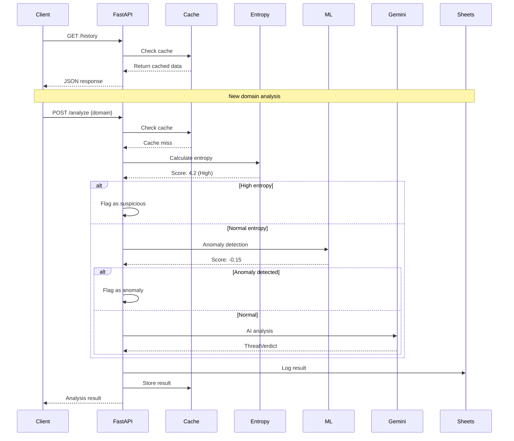

---

## Performance Metrics

### System Performance

| Metric | Value | Description |
|--------|-------|-------------|
